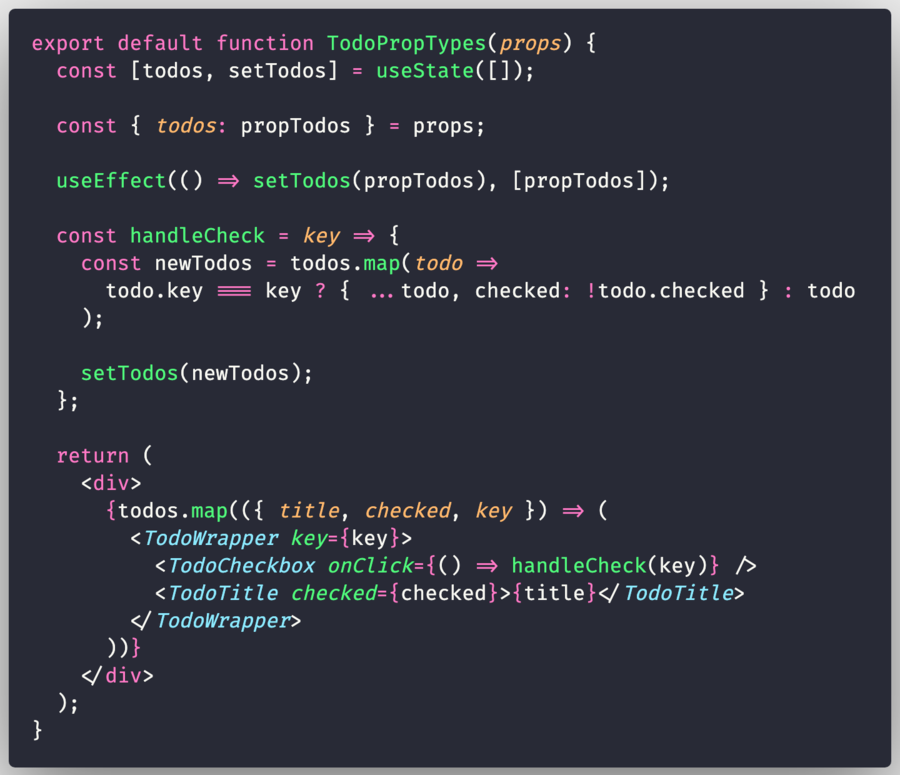
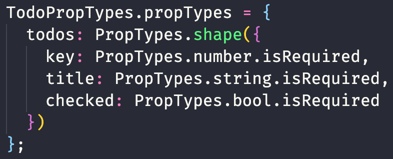
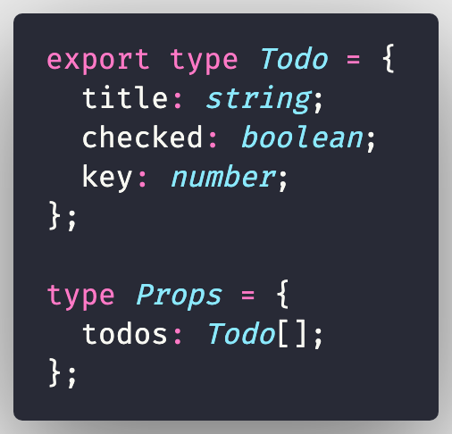
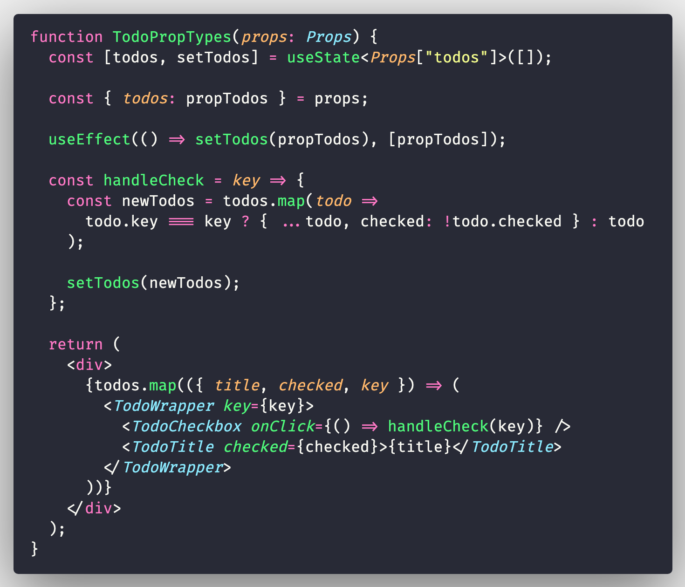
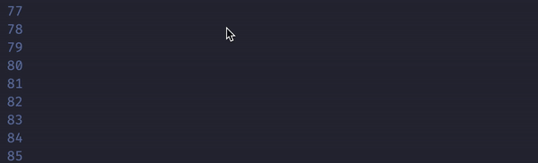
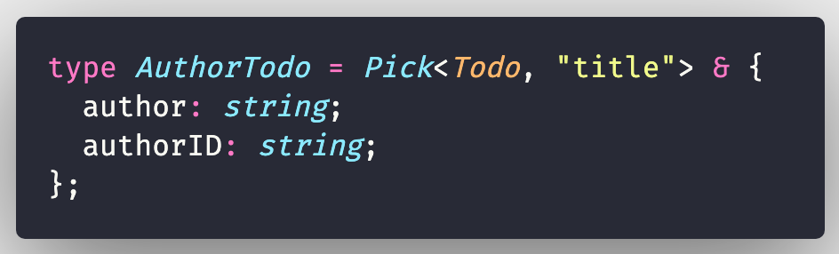
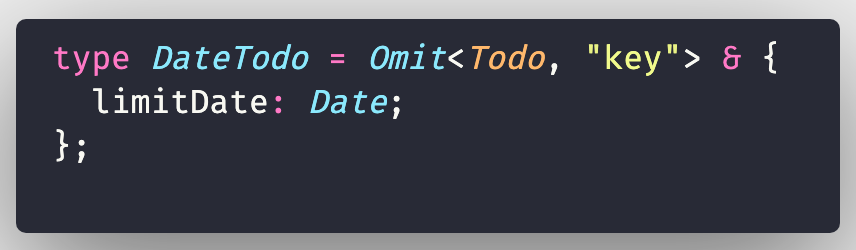
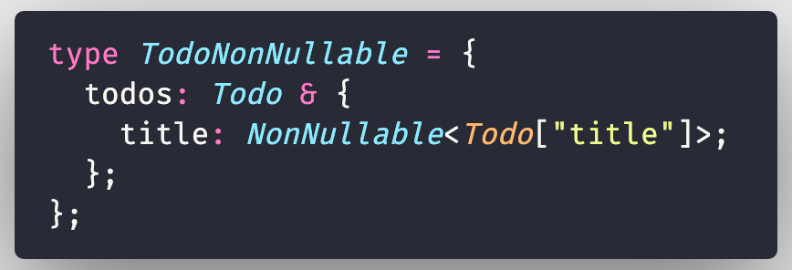
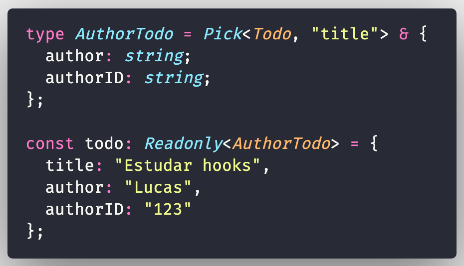
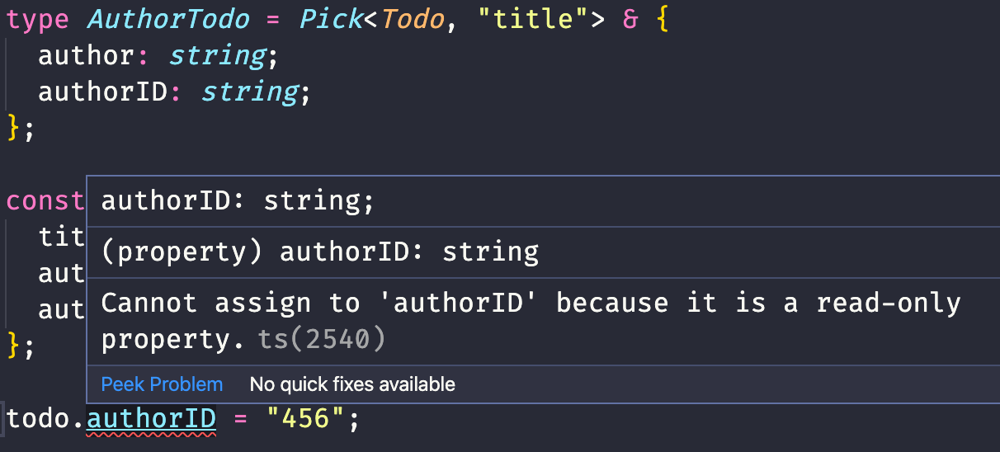

import { themes, Appear, Head, Image } from "mdx-deck";

import { Hello, Img, Cover } from "./components/index";

export const theme = themes.dark;

<Head>
  <title>React.js com TypeScript: O que pode dar errado?</title>
</Head>
<Cover />

---

<Hello />

---

---

## Por que?

---

Benefícios de um código tipado

<ul>
  <Appear>
    <li>Escalabilidade</li>
    <li>Legibilidade</li>
    <li>Produtividade</li>
  </Appear>
</ul>

---

---

## PropTypes x TypeScript

---

---

import TodoPropTypes, { todos } from "./exemplos/TodoPropTypes";

<TodoPropTypes todos={todos} />

---

## Exemplo: PropTypes

---

## Exemplo: TypeScript

---

---

## Pontos positivos

<ul>
  <Appear>
    <li>Desacoplamento</li>
    <li>
      <strong>Legibilidade</strong>
    </li>
    <li>Melhor DX</li>
  </Appear>
</ul>

---

## _Developer Experience_

---

## Type Composition

<ul>
  <Appear>
    <li>Pick</li>
    <li>Omit</li>
    <li>NonNullable</li>
    <li>ReadOnly</li>
  </Appear>
</ul>

---

## Type Composition: Pick

---

## Type Composition: Omit

---

## Type Composition: NonNullable

---

## Type Composition: ReadOnly

---

## Type Composition: ReadOnly

